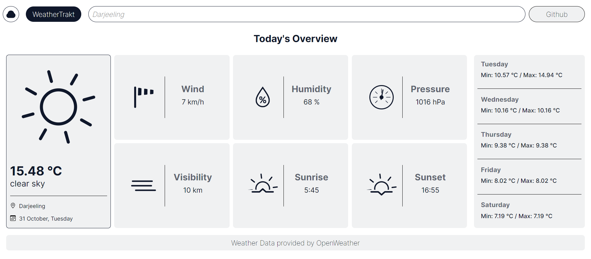

# WeatherTrakt

WeatherTrakt is a simple web application that allows you to get real-time weather information for a specified location. It uses the OpenWeather API to provide accurate and up-to-date weather data.

## Features

- Get current weather data including temperature, sky conditions, and location.
- Detailed weather information such as wind speed, humidity, pressure, visibility, and more.
- Sunrise and sunset times.
- 5-day weather forecast.

## How to Use

1. Visit the [WeatherTrakt](https://1vishen.github.io/weather-trakt/) web app.
2. Enter the name of the city or location you want to check the weather for in the search box.
3. Press Enter.
4. Weather information for the specified location will be displayed.

## Installation

If you want to run this project locally, follow these steps:

1. Clone the repository to your local machine.
2. Open the `index.html` file in your web browser.

## API Key

This project uses the OpenWeather API to fetch weather data. You will need to obtain an API key from [OpenWeather](https://openweathermap.org/api) and replace `"apiKey"` in the JavaScript code with your actual API key.

## Acknowledgments

- Weather data provided by [OpenWeather](https://openweathermap.org/).
